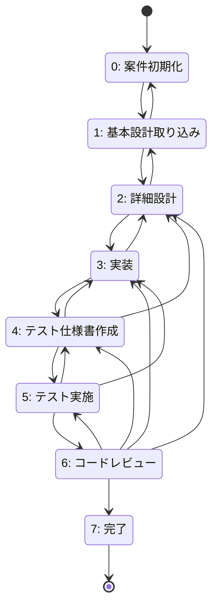

# エージェント状態遷移図

```mermaid
stateDiagram-v2
    [*] --> case_init

    state "0: 案件初期化" as case_init
    state "1: 基本設計取り込み" as basic_design_import
    state "2: 詳細設計" as detailed_design
    state "3: 実装" as implementation
    state "4: テスト仕様書作成" as test_specification
    state "5: テスト実施" as test_execution
    state "6: コードレビュー" as code_review
    state "7: 完了" as workflow_complete

    case_init --> basic_design_import

    basic_design_import --> case_init
    basic_design_import --> detailed_design

    detailed_design --> basic_design_import
    detailed_design --> implementation

    implementation --> detailed_design
    implementation --> test_specification

    test_specification --> detailed_design
    test_specification --> implementation
    test_specification --> test_execution

    test_execution --> test_specification
    test_execution --> code_review
    test_execution --> implementation

    code_review --> detailed_design
    code_review --> implementation
    code_review --> test_specification
    code_review --> test_execution
    code_review --> workflow_complete

    workflow_complete --> [*]
```
